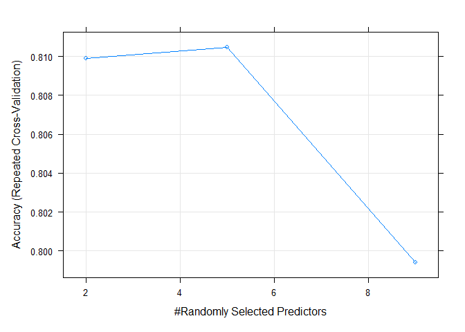
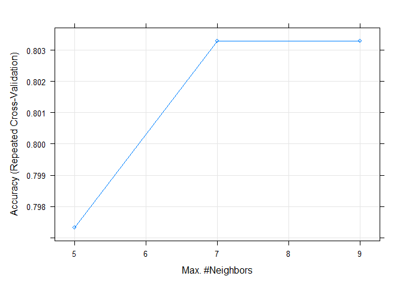
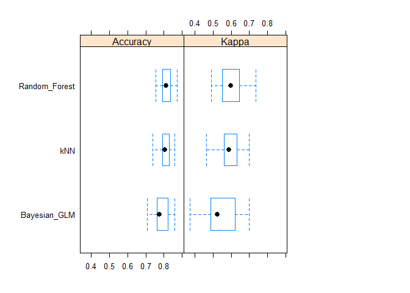
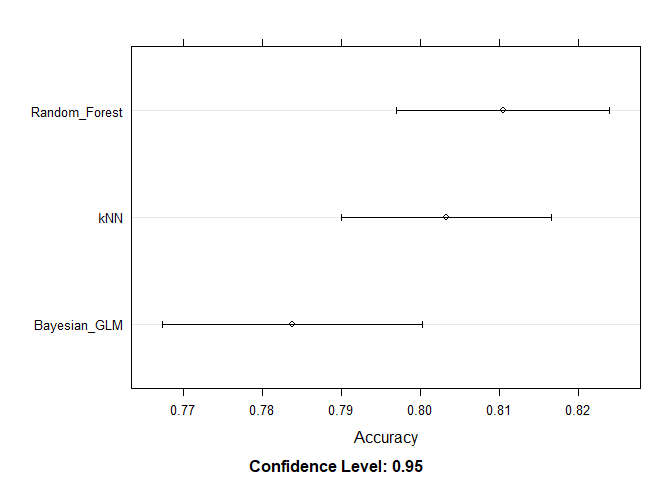
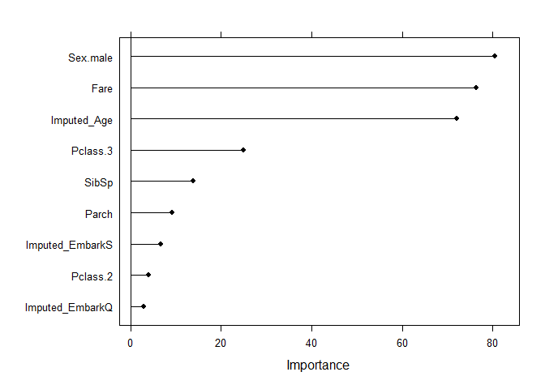

# Machine_Learning_with_Caret

The purpose of this project is to demonstrate how to build a machine learning pipeline and train a predictive model in R using the [caret package](https://topepo.github.io/caret/index.html). For the purposes of this simple demonstration, I used data from the [Titanic prediction](https://www.kaggle.com/competitions/titanic/overview) competition in Kaggle.

In the end, I was able to build a series of models and compare their ability to predict accurately whether a passenger in the Titanic would survive or not. The final model selected predicted survival with 80% accuracy.


In this project, you will be able to find the following:
- Markdown file named "Caret_Demonstration.md" You should _open this file first_ as it provides a comprehensive explanation of the entire process of loading data, building a machine learning pipeline, training a series of models (using cross-validation to tune hyperparameters), comparing models based on their accuracy, and evaluating the performance of the final model against the testing dataset.
- Quarto markdown file named "Caret_Demonstration.qmd"
- An R project file "Machine_Learning_with_Caret.Rproj", this file will allow you set up your working environment and should be set up first if you are looking to replicate my work.
- Lastly, you will find two folders. The "Data" folder contains the original data I downloaded from Kaggle. The "Caret_Demonstration_files" contains the images made when rendering the markdown file in Quarto.

# Machine Learning Pipelines and Model Building in Caret
Sebastian Santana Ortiz

- [Set up & Data Management](#set-up--data-management)
  - [Splitting data](#splitting-data)
  - [Understanding Feature Types & Exploratory Data
    Analysis](#understanding-feature-types--exploratory-data-analysis)
- [Building pipeline](#building-pipeline)
  - [Imputation](#imputation)
  - [Numeric variable transformation](#numeric-variable-transformation)
  - [Dummy variables](#dummy-variables)
- [Building models](#building-models)
  - [Fitting & hyperparameter tuning](#fitting--hyperparameter-tuning)
- [Comparing models and testing](#comparing-models-and-testing)
  - [Model choice](#model-choice)
  - [Final model on test set](#final-model-on-test-set)

The purpose of this file is to provide a quick demonstration on how to
set up a machine learning pipeline and build a set of predictive models
using the [caret package](https://topepo.github.io/caret/index.html) in
R.

The text below will be split into three sections:

1.  Set up & Data management
2.  Building a pipeline
3.  Building models
4.  Testing models

Note that the data used for this demonstration is from the [Kaggle
competition](https://www.kaggle.com/competitions/titanic/overview)
“**Titanic - Machine Learning from Disaster”,** a beginner friendly
dataset that is commonly used for demonstration purposes.

## Set up & Data Management

``` r
# Load required packages
library(caret)
library(caretEnsemble)
library(data.table)
library(tidyr)
library(dplyr)
library(kableExtra)
library(skimr)

# Model-specific libraries
library(kknn)
library(arm)
library(caTools)
```

Our first objectives are to split the data and to understand the types
of features/factors we have access to in the training set.

``` r
# Load titanic dataset already split by kaggle
train_read = fread('./Data/train.csv')
```

### Splitting data

In machine learning, there is a crucial principle: no information from
the testing fold should bleed into our prediction set. If we were to
center our features on the *global average* (including observations from
the training and testing folds) before splitting the data, then our
model would have information on the testing set even if it only trained
on the training observations.

Hence, when we center variables, we should only use values from the
training set. Then, we can apply those transformations to the test set.

``` r
# This step is crucial to ensure reporudicbility when splitting data
set.seed(101) 

# This section of code randomly seletcs 75% of the entries in the original dataset, these will be included in the training set
intrain = createDataPartition(y=train_read$Survived, p=0.75, list=FALSE)

# Subsets data based and creates testing and training folds
train_raw = 
  train_read[intrain,]; train_read$Survived = as.factor(train_read$Survived)
test_raw = 
  train_read[-intrain,]; train_read$Survived = as.factor(train_read$Survived)
```

### Understanding Feature Types & Exploratory Data Analysis

According to the data set description the following variables should be
present in the training set.

|              |                                             |                                                |
|:------------:|:-------------------------------------------:|:----------------------------------------------:|
| **Variable** |               **Description**               |                    **Key**                     |
|   survival   |                  Survival                   |                0 = No, 1 = Yes                 |
|    pclass    |                Ticket class                 |           1 = 1st, 2 = 2nd, 3 = 3rd            |
|     sex      |                     Sex                     |                                                |
|     Age      |                Age in years                 |                                                |
|    sibsp     | \# of siblings / spouses aboard the Titanic |                                                |
|    parch     | \# of parents / children aboard the Titanic |                                                |
|    ticket    |                Ticket number                |                                                |
|     fare     |               Passenger fare                |                                                |
|    cabin     |                Cabin number                 |                                                |
|   embarked   |             Port of Embarkation             | C = Cherbourg, Q = Queenstown, S = Southampton |

``` r
# Quick summary of character features training set

skimr::skim(train_raw)%>%
  yank("character")%>%
  dplyr::select(-min, -max, -whitespace, -complete_rate)
```

**Variable type: character**

| skim_variable | n_missing | empty | n_unique |
|:--------------|----------:|------:|---------:|
| Name          |         0 |     0 |      669 |
| Sex           |         0 |     0 |        2 |
| Ticket        |         0 |     0 |      538 |
| Cabin         |         0 |   502 |      131 |
| Embarked      |         0 |     1 |        4 |

``` r
# Note: we should only look at the testing set once and only once (i.e., when we test the final model)
```

``` r
# Quick summary of all other features in training set

skimr::skim(train_raw)%>%
  yank("numeric")%>%
  dplyr::select(!(p0:hist))
```

**Variable type: numeric**

| skim_variable | n_missing | complete_rate |   mean |     sd |
|:--------------|----------:|--------------:|-------:|-------:|
| PassengerId   |         0 |          1.00 | 443.24 | 256.58 |
| Survived      |         0 |          1.00 |   0.40 |   0.49 |
| Pclass        |         0 |          1.00 |   2.27 |   0.85 |
| Age           |       127 |          0.81 |  29.91 |  14.52 |
| SibSp         |         0 |          1.00 |   0.52 |   1.10 |
| Parch         |         0 |          1.00 |   0.39 |   0.82 |
| Fare          |         0 |          1.00 |  33.56 |  53.14 |

``` r
# Note: we should only look at the testing set once and only once (i.e., when we test the final model)
```

Based on the brief exploratory analaysis done above, it is clear that
the raw data needs to be modified before being used build our models.

- The “pclass” variable needs to be relabeled as *factor*.

  - Survival on the other can be left as a binary variable. In this
    case, our models will be able to predict the probability of survival
    and this can easily be turned into a binary variable later on (e.g.,
    all predictions above .5 are relabeledto 1 or “survived”).

- The variables Ticket and Cabin have a large number of categories, more
  than likely with few entries per category. Future attempts could find
  some data-driven or conceptual reason to group entries for these
  features (e.g., most expensive cabins, or tickets of specific
  families). However, for the sake of simplicity these variables will be
  removed for the time being.

- I will also remove passenger ID and name, this variable can be brought
  back later on but should not have any predictive capacity.

``` r
# Note that at this point I am only recoding or removing variables. Centering and imputation will take place later on.

train = train_raw%>%
  dplyr::select(-PassengerId, -Name, -Ticket, -Cabin)%>%
  dplyr::mutate(Pclass = as.factor(Pclass),
         Survived = as.factor(Survived))%>%
  dplyr::mutate_if(is.character, as.factor)

test = test_raw%>%
  dplyr::select(-PassengerId, -Name, -Ticket, -Cabin)%>%
  dplyr::mutate(Pclass = as.factor(Pclass),
         Survived = as.factor(Survived))%>%
  dplyr::mutate_if(is.character, as.factor)
```

## Building pipeline

Pipelines are necessary tools in machine learning that organize and
standardize sequential transformations to a set of features/factors.
They can ensure that both the training and test sets have the *exact
same operations done*.

In this case, our pipeline needs to manage two issues:

- **Missing data**: We will use imputation to manage missing entries in
  Age and Embarked features.

- **Different feature types**: We have both numeric and character
  variables. Hence, we will have to apply at least two types of
  transformations: numeric (e.g., centering and scaling) and categorical
  (e.g., dummy coding).

  - There are **many other forms** of transformations (e.g., log, square
    root, kernel, binning, and more). I will not be using these advanced
    techniques for the sake of simplicity.

------------------------------------------------------------------------

### Imputation

For the sake of simplicity, I will only impute simple values here. I
will impute the average for Age and the most common entry for Embarked
in the *training set*. However, note that there are far more advance
means of managing missing data. For example, the preProcess function
itself is able to use a K-Nearest Neighbors regression model to impute
values.

``` r
# Imputation for age and embarked

# Note that values imputed for the testing DF are based on the training DF (to avoid data leakage between testing and training sets)

# Find the mode of Embarked
# Use table to count occurrences of each level
factor_counts <- table(train$Embarked)

# Identify the level with the highest count (the mode)
mode_train_Embark <- names(factor_counts[factor_counts == max(factor_counts)])


train_imputed = train%>%
  dplyr::mutate(
    # Imputing missing cases (which were actually "" in the data as the mode)
    Imputed_Embark = case_when(
      Embarked == "" ~ mode_train_Embark,
      .default = Embarked),
    # Impute the mean of Age (training) to all entries with missing values
    Imputed_Age = ifelse(
      is.na(Age), mean(train$Age, na.rm = TRUE), Age
    ))%>%
  dplyr::select(-Embarked, -Age)

test_imputed = test%>%
  dplyr::mutate(
    # Imputing missing cases (which were actually "" in the data as the mode)
    Imputed_Embark = case_when(
      Embarked == "" ~ mode_train_Embark,
      .default = Embarked),
    # Impute the mean of Age (training) to all entries with missing values
    Imputed_Age = ifelse(
      is.na(Age), mean(train$Age, na.rm = TRUE), Age
    ))%>%
  dplyr::select(-Embarked, -Age)
```

------------------------------------------------------------------------

### Numeric variable transformation

Scaling is a useful tool that helps us ensure all predictors are based
on the same unit (i.e., centered on the mean and divided by the standard
deviation. In this example I am only using four [preProcess
methods](https://www.rdocumentation.org/packages/caret/versions/6.0-92/topics/preProcess):
centering, scaling, removing variables with zero variance, and removing
highly correlated features. However, note that there are many more
options available.

``` r
# Defining pre-processor
pre_processor = preProcess(
  # "Training" our preprocessor on the training gata
  train_imputed,
  # Specifies transformations to continuous data
  method = c(
    # Substracts the mean fro every entry
    "center",
    # Divides entries by the standard deviation
    "scale",
    # Removes features with near zero variance 
    "nzv",
    # Removes highly correlated variables (removes variable with largest mean absolute correlation)
    "corr"))
```

| Survived | Pclass | Sex    | SibSp | Parch |    Fare | Imputed_Embark | Imputed_Age |
|:---------|:-------|:-------|------:|------:|--------:|:---------------|------------:|
| 0        | 3      | male   |     1 |     0 |  7.2500 | S              |    22.00000 |
| 1        | 1      | female |     1 |     0 | 71.2833 | C              |    38.00000 |
| 1        | 3      | female |     0 |     0 |  7.9250 | S              |    26.00000 |
| 1        | 1      | female |     1 |     0 | 53.1000 | S              |    35.00000 |
| 0        | 3      | male   |     0 |     0 |  8.0500 | S              |    35.00000 |
| 0        | 3      | male   |     0 |     0 |  8.4583 | Q              |    29.90867 |

Before Scaling

``` r
# Transforms data in training
train_scaled <- predict(pre_processor, train_imputed)

# Transforms data in testing, based on preprocessor fitted on training
test_scaled <- predict(pre_processor, test_imputed)
```

| Survived | Pclass | Sex    |      SibSp |      Parch |       Fare | Imputed_Embark | Imputed_Age |
|:---------|:-------|:-------|-----------:|-----------:|-----------:|:---------------|------------:|
| 0        | 3      | male   |  0.4395389 | -0.4719637 | -0.4951966 | S              |  -0.6052220 |
| 1        | 1      | female |  0.4395389 | -0.4719637 |  0.7098968 | C              |   0.6192000 |
| 1        | 3      | female | -0.4736645 | -0.4719637 | -0.4824932 | S              |  -0.2991165 |
| 1        | 1      | female |  0.4395389 | -0.4719637 |  0.3676909 | S              |   0.3896209 |
| 0        | 3      | male   | -0.4736645 | -0.4719637 | -0.4801407 | S              |   0.3896209 |
| 0        | 3      | male   | -0.4736645 | -0.4719637 | -0.4724566 | Q              |   0.0000000 |

After Scaling

Based on the print out above, it is clear that only the continuous
features were scaled (i.e., “SibSp”, “Parch”, “Fare”, and
“Imputed_Age”). As well, all four features were retained suggesting they
do have sufficient variances and are not correlated to each other. The
next step now is to transform the factor variables.

------------------------------------------------------------------------

### Dummy variables

Dummy variables are binary encodings of categorical variables. In this
example, Embarked had three categories. In order for this feature to be
used we need to create a binary variable for each individual category
that was present in the original variable. This need for dummy coding is
why we removed variables such as Ticket and Cabin. For every unique
value they had (e.g., 681 for Ticket) a new and unique variable would
have to be created with only 0 (for not present) or 1 (present) for each
category.

| Survived | Pclass | Sex    |      SibSp |      Parch |       Fare | Imputed_Embark | Imputed_Age |
|:---------|:-------|:-------|-----------:|-----------:|-----------:|:---------------|------------:|
| 0        | 3      | male   |  0.4395389 | -0.4719637 | -0.4951966 | S              |  -0.6052220 |
| 1        | 1      | female |  0.4395389 | -0.4719637 |  0.7098968 | C              |   0.6192000 |
| 1        | 3      | female | -0.4736645 | -0.4719637 | -0.4824932 | S              |  -0.2991165 |
| 1        | 1      | female |  0.4395389 | -0.4719637 |  0.3676909 | S              |   0.3896209 |
| 0        | 3      | male   | -0.4736645 | -0.4719637 | -0.4801407 | S              |   0.3896209 |
| 0        | 3      | male   | -0.4736645 | -0.4719637 | -0.4724566 | Q              |   0.0000000 |

Before Dummy Coding

``` r
# The code below uses the dummyVars function from the caret package to build a model.matrix

# Ensure outcome variables are ordered factors
train_scaled$Survived = factor(train_scaled$Survived, levels = c(0,1))
test_scaled$Survived = factor(test_scaled$Survived, levels = c(0,1))


# Creates Matrix with new Variables
dmy_train = dummyVars(" ~ .", data = train_scaled, fullRank = T)
# Fits to training set
train_transformed <- data.frame(predict(dmy_train, newdata = train_scaled))
train_transformed$Survived.1 = factor(train_transformed$Survived.1, levels = c(0,1))

# Same applied to testing set
dmy_test = dummyVars(" ~ .", data = test_scaled, fullRank = T)
test_transformed <- data.frame(predict(dmy_test, newdata = test_scaled))
test_transformed$Survived.1 = factor(test_transformed$Survived.1, levels = c(0,1))
```

| Survived.1 | Pclass.2 | Pclass.3 | Sex.male |      SibSp |      Parch |       Fare | Imputed_EmbarkQ | Imputed_EmbarkS | Imputed_Age |
|:-----------|---------:|---------:|---------:|-----------:|-----------:|-----------:|----------------:|----------------:|------------:|
| 0          |        0 |        1 |        1 |  0.4395389 | -0.4719637 | -0.4951966 |               0 |               1 |  -0.6052220 |
| 1          |        0 |        0 |        0 |  0.4395389 | -0.4719637 |  0.7098968 |               0 |               0 |   0.6192000 |
| 1          |        0 |        1 |        0 | -0.4736645 | -0.4719637 | -0.4824932 |               0 |               1 |  -0.2991165 |
| 1          |        0 |        0 |        0 |  0.4395389 | -0.4719637 |  0.3676909 |               0 |               1 |   0.3896209 |
| 0          |        0 |        1 |        1 | -0.4736645 | -0.4719637 | -0.4801407 |               0 |               1 |   0.3896209 |
| 0          |        0 |        1 |        1 | -0.4736645 | -0.4719637 | -0.4724566 |               1 |               0 |   0.0000000 |

After Dummy Coding

## Building models

It is worth noting that caret is able to accommodate a *very
large* number of machine learning models. In this case I will only test
the capabilities of three: Bayesian Generalized Linear Model (bayesglm),
Random Forest (rf), and k-Nearest Neighbors, or *kNN*, (kknn).

These three models are able to accommodate classification problems,
which is the case in this example. For more information, see the [caret
documentation](https://topepo.github.io/caret/available-models.html)or
use the command getModelInfo() to see more.

### Fitting & hyperparameter tuning

Hyperparameters are model-specific characteristics that can be altered
to optimize model fit. For the sake of simplicity, I will only specify a
5-fold cross-validation but note that caret does accommodate
[model-specific hyperparameter
grids](https://topepo.github.io/caret/model-training-and-tuning.html#basic-parameter-tuning).

``` r
fitControl <- trainControl(# 5-fold CV
                           method = "repeatedcv",
                           # number of folds
                           number = 5,
                           # repeated ten times
                           repeats = 5)
```

> Bayesian Generalized Linear Model

``` r
set.seed(1231)

bayesglm_T = train(Survived.1 ~ ., data = train_transformed, 
                 method = "bayesglm", 
                 trControl = fitControl)
```

> Random Forest

``` r
set.seed(1231)

rf_T = train(Survived.1 ~ ., data = train_transformed, 
                 method = "rf", 
                 trControl = fitControl)
```

> k-Nearest Neighbors

``` r
set.seed(1231)

kNN_T = train(Survived.1 ~ ., data = train_transformed, 
                 method = "kknn", 
                 trControl = fitControl)
```

> Contrast: accuracy as a function of max neighbors in both Random
> Forest and kNN

``` r
# First plot: LogitBoost
plot(rf_T, metric = "Accuracy")  
```



``` r
# Second plot: kNN
plot(kNN_T, metric = "Accuracy")  
```



From the graphs above, it is clear that over our cross-validation we
were able to explore a sufficient range for model hyperparameters. For
example, for kNN. It is clear that the model does not gain any accuracy
from using more than 7 nearest neighbors when making a prediction.

Now that all models have been fitted, the next step is to compare them
all and identify the best classification model among the three fitted
models.

## Comparing models and testing

The caret package has some functionality to use resampling distributions
to compare the efficacy of trained machine learning models.

``` r
set.seed(1231)
resamps <- resamples(list(Bayesian_GLM = bayesglm_T,
                          Random_Forest = rf_T,
                          kNN = kNN_T))
resamps$timings%>%
  dplyr::select(-Prediction)
```

                  Everything FinalModel
    Bayesian_GLM        0.61       0.02
    Random_Forest      18.91       0.28
    kNN                 8.52       0.13

``` r
summary(resamps)
```


    Call:
    summary.resamples(object = resamps)

    Models: Bayesian_GLM, Random_Forest, kNN 
    Number of resamples: 25 

    Accuracy 
                       Min.   1st Qu.    Median      Mean   3rd Qu.      Max. NA's
    Bayesian_GLM  0.7089552 0.7611940 0.7761194 0.7838357 0.8208955 0.8582090    0
    Random_Forest 0.7537313 0.7910448 0.8134328 0.8104657 0.8358209 0.8731343    0
    kNN           0.7388060 0.7910448 0.8059701 0.8032970 0.8283582 0.8582090    0

    Kappa 
                       Min.   1st Qu.    Median      Mean   3rd Qu.      Max. NA's
    Bayesian_GLM  0.3729302 0.4872040 0.5256077 0.5418503 0.6229777 0.6985555    0
    Random_Forest 0.4906153 0.5513035 0.5980322 0.5984984 0.6450758 0.7338163    0
    kNN           0.4625258 0.5599611 0.5888600 0.5841534 0.6301896 0.6985555    0

``` r
bwplot(resamps, layout = c(3, 1))
```



``` r
trellis.par.set(caretTheme())
dotplot(resamps, metric = "Accuracy")
```



Based on the plots above, three things are clear:

1.  The Bayesian Generalized Linear Model, as fitted, is underperfoming
    the kNN and Random Forest models .

2.  The Random Forst model took the longest to train, with kNN trailing
    behind and the BGLM model being the fastest.

3.  Based on the dotplot and descriptive summary, it seems that the
    difference between kNN and Random Forest is quite small. However,
    kNN looks like it has a smaller range between its maximum and
    minimum accuracy, suggesting it is less likely to be overfit.

### Model choice

Based on these findings, among the three models, it seems that kNN with
k = 7 is the optimal model.

``` r
summary(kNN_T$finalModel)
```


    Call:
    kknn::train.kknn(formula = .outcome ~ ., data = dat, kmax = param$kmax,     distance = param$distance, kernel = as.character(param$kernel))

    Type of response variable: nominal
    Minimal misclassification: 0.1913303
    Best kernel: optimal
    Best k: 7

It is worth noting that for other models, it is possible to visualize
variable importance in Caret. However, kNN’s algorithm does place
special importance on any feature when making a prediction. In the
example below, the code computes variable importance for the random
forest model and plots them (remember that importance does not speak to
directionality of the effect on the outcome).

``` r
var_imp <- varImp(rf_T, scale = FALSE)
plot(var_imp)
```



### Final model on test set

Note that this model was built with default settings for optimization.
There are a number of metrics that could be considered (e.g.,
Sensitivity, Specificty, ROC, AUC, Fal-Positive Rate, and more).
However, for this purpuse (specially because we did not see a serious
class imbalance in the outcome) I only focused on accuracy.

``` r
# Predict here is used to create predictions based on our trained model
predictions = predict(kNN_T, newdata = test_transformed)

confusionMatrix(data = predictions, reference = test_transformed$Survived.1)
```

    Confusion Matrix and Statistics

              Reference
    Prediction   0   1
             0 122  20
             1  23  57
                                              
                   Accuracy : 0.8063          
                     95% CI : (0.7481, 0.8561)
        No Information Rate : 0.6532          
        P-Value [Acc > NIR] : 3.856e-07       
                                              
                      Kappa : 0.5764          
                                              
     Mcnemar's Test P-Value : 0.7604          
                                              
                Sensitivity : 0.8414          
                Specificity : 0.7403          
             Pos Pred Value : 0.8592          
             Neg Pred Value : 0.7125          
                 Prevalence : 0.6532          
             Detection Rate : 0.5495          
       Detection Prevalence : 0.6396          
          Balanced Accuracy : 0.7908          
                                              
           'Positive' Class : 0               
                                              

The accuracy reported above is fairly consistent and suggests that our
kNN model is not over-fit on our training set. There are still may other
modeling techniques (e.g., DBSCAN, SVM, Extreme Gradient Boosted trees,
ensemble models, Generalized Linear Models, and more) and further
operations (e.g., more precise feature-engineering or hyper-parameter
tuning). However, we can feel satisfaction in knowing that we have built
and tested a machine learning model in R using Caret!
